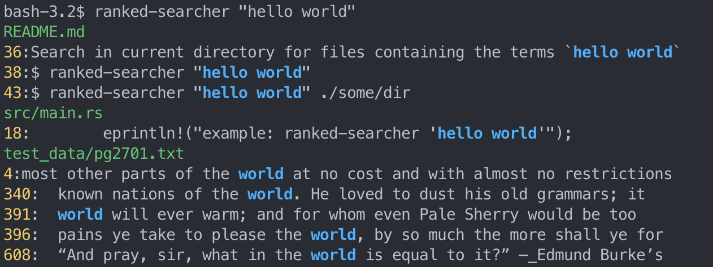

# Ranked Searcher


Search inside text files showing the most relevant search at the top, based on the well known tf-idf formula.
It’s pretty fast, considering the fact it has to gather all the files first and then rank them accordingly.

## ✨ Features

- Search inside all text based files
- Most relevant search at the top
- Highlights the terms that were searched for
- Supports `docx` files
- Respects `.gitignore` files

## 🚀 Installation

#### Cargo (cross-platform)
```bash
$ cargo install ranked-searcher
```

## 🎯 Usage

Search in current directory for files containing the terms `hello world`
```bash
$ rs "hello world"
```

Or search inside a given directory (optional)
```bash
$ rs "hello world" ./some/dir
```

Example output:


